# EECS3311 Fall 2026 — Course Project, Stage 1
# Mealton: AI Smart Recipe and Meal Planning Agent

**Student:** _[Rebekah Uson - 221123310]_  

> Diagrams are written in Mermaid and render automatically on GitHub. Editable UMLet versions of the class diagrams are in the `diagrams/` folder.

### Where to find each Stage 1 deliverable

| # | Stage 1 deliverable | Section |
|---|---|---|
| 1 | Project Overview (problem, users, agent, models, architecture) | Task 1 → 1.1 |
| 2 | Detailed Feature Specifications | Task 1 → 1.2 |
| 3 | UML Class Diagram | Task 2 → 2.1 |
| 4 | Design Pattern Explanations | Task 2 → 2.1 (Design Patterns) |
| 5 | Use-Case Diagram | Task 2 → 2.2 |
| 6 | Detailed Use-Case Descriptions | Task 2 → 2.2 |
| 7 | Sequence Diagrams | Task 2 → 2.3 |
| 8 | Feature-to-Design Traceability Table | Task 3 |
| 9 | Feature Implementation Explanations | Task 4 |

---

# Task 1: Define Your Agent Project

## 1.1 Project Description

### What problem does your project solve?
Many people struggle to decide what to eat. They repeat the same few meals, have ingredients at home but don't know what to make with them, and let food expire. Planning is harder still for people with allergies, dietary restrictions or macro goals, who must find or modify suitable recipes. Existing apps usually handle only one piece (recipes, or calorie counting, or a shopping list). Mealton brings these together: it uses what the user already has, together with their preferences and restrictions, to suggest recipes, plan the week, schedule a prep day and build the shopping list, which makes deciding what to eat easier and reduces food waste.

### Who are the target users?
Mealton is a general-purpose application. Typical users include:
- people who keep making the same meals and want new ideas, or who find it hard to decide what to eat;
- people who want to cook with ingredients they already have, and reduce food waste by using food before it expires;
- fitness-focused users who track calories and macros;
- vegetarian and vegan users, users with food allergies, and users with other dietary restrictions;
- people who want help planning meals for a whole week.

### What can the agent do?
*Mealton* is an AI agent that can:
- build a full **weekly meal plan** from the user's profile, calorie target, allergies and pantry;
- schedule a **prep day**, a batch-cooking plan for the week's meals within the user's available time;
- recommend **recipes based on the current pantry**, prioritising ingredients close to spoilage;
- find recipes with **missing ingredients** and add those ingredients to the shopping list;
- categorise items, estimate nutrition and tag recipes;
- **carry out requests in natural language** ("make my week high-protein with no nuts"), editing the plan, pantry or shopping list through tools.

The agent performs multi-step, cross-feature tasks rather than generating a recipe and stopping.

### Why is an AI agent appropriate for this problem?
Meal planning combines many pieces of information and decisions that depend on the user's situation. For example, a user might say: *"I have chicken, rice, broccoli and eggs, I don't want what I had last week, and I only have 30 minutes."* Mealton must read the pantry, check restrictions, look at the calendar, search recipes, check nutrition, and then act: add missing items to the list or place the meal on the calendar. That needs reasoning, planning, tool use, memory of preferences and re-planning when a check fails. A traditional recipe database or a single LLM call cannot coordinate those steps across the application.

### Which AI/LLM model(s) do you plan to use?
An external, tool-calling LLM. Because cost matters, the default will be a **low-cost model**, such as **Claude Haiku 4.5** (Anthropic) or an OpenAI "mini"-tier model. The final choice depends on API availability, cost, tool-calling support and how well it handles the agent tasks. The choice is not locked in: the model is only accessed through our own `LLMClient` interface (Adapter pattern), so changing provider only means writing one adapter. A `MockLLMClient` is used for testing without cost. Nutrition data comes from a nutrition API (USDA FoodData Central) behind a `NutritionProvider` adapter, with LLM estimation as a fallback.

### How will the AI model interact with the rest of the software system?
The AI runs as an agent inside the application, not as a standalone chatbot. `MealtonAgent` runs a reasoning and tool-use loop. It sends the conversation plus a list of tool schemas to `LLMClient`. If the model requests a tool, the agent looks it up in `ToolRegistry`, runs it (the tool calls ordinary services such as `PantryInventory`, `RecipeService` and `PlanService`), returns the result to the model, and repeats until the model gives a final answer. The five tools are `PantryTool`, `RecipeSearchTool`, `NutritionTool`, `ShoppingListTool` and `CalendarTool`. `AgentMemory` stores recent turns and the user's learned preferences. All AI output is **checked by deterministic code** (for example `PlanValidator` for allergens and calorie bounds, and the prep-time check) before it is saved or presented as final.

**Typical interaction.** User: *"I have chicken, rice, spinach and tomatoes. What can I make for dinner?"*
1. The agent retrieves the pantry inventory (`PantryTool`).
2. It checks the dietary restrictions and preferences from the profile and memory.
3. It searches suitable recipes (`RecipeSearchTool`) and checks nutrition (`NutritionTool`).
4. It decides which recipe fits best and which ingredients are missing.
5. It presents the suggestions; if the user selects one, it adds the missing ingredients to the shopping list (`ShoppingListTool`) and can place the meal on the calendar (`CalendarTool`).

### Minimum requirements coverage

| Requirement | How it is met |
|---|---|
| GUI | Desktop GUI with pages for Login, Calendar / Meal Plan, Recipe Browser, Pantry / Shopping List and Profile, plus a floating, draggable Mealton chat avatar |
| CLI | `mealton` command-line app calling the same `MealtonFacade` as the GUI (see CLI overview below) |
| At least 10 meaningful features | 14 features (F01–F14). Login/Logout/Register are not counted |
| At least 5 design patterns | Strategy, Observer, Command, Factory Method, Adapter, Facade, Composite, State (plus MVC and Repository) |
| AI model | LLM through `LLMClient`; nutrition API through `NutritionProvider` |
| Agent behaviour | Reasoning loop, planning, tool use (5 tools), memory (`AgentMemory`), multi-step execution, validation and re-planning |

### Overall architecture

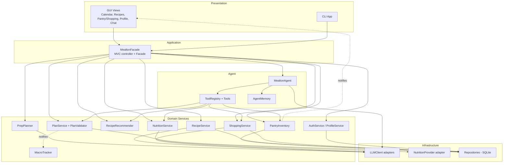

### CLI overview

The CLI exposes the major functionality and calls the same `MealtonFacade` methods as the GUI.

```
mealton login --email a@b.com
mealton profile set --weight 70 --height 175 --allergies peanuts,shellfish
mealton plan-week --calories 2000 --diet vegetarian
mealton calendar add --date 2026-11-02 --label Lunch --recipe 14 --servings 2
mealton macros --date 2026-11-02
mealton prep --minutes 120
mealton pantry add "spinach" --qty 200 --unit g --expires 2026-11-05
mealton pantry list | mealton pantry expiring
mealton recipes --from-pantry --filter asian | mealton recipes --missing
mealton recipe scale 14 --servings 4 | mealton recipe nutrition 14 | mealton recipe rate 14 5
mealton shopping add|list|check|delete|clear-checked|undo
mealton chat "make my week high-protein with no nuts"
```

---

## 1.2 Feature Specification

The project has **14 major features (F01–F14)**. Each is specified with: Feature ID and Name, Description, User Interaction, Input, Output, AI Involvement, Expected Workflow, and Error/Alternative Cases. Every feature is reachable through the GUI (and the equivalent CLI command). Login/Logout/Register exist (UC00) but are **not** counted among the 14 features.

### F01 — Profile and Dietary Constraints
- **Description:** Stores name, DoB, weight, height, sex, goal, allergies, dietary restrictions, and computes a suggested daily calorie target
- **User Interaction:** Profile page: form fields, allergy/diet chips, "Save" button; calorie suggestion shown beside the goal selector
- **Input:** Name, email, DoB, weight, height, sex, goal (lose/maintain/gain), allergies, restrictions
- **Output:** Saved `Profile`, suggested calorie target, confirmation message
- **AI Involvement:** Hybrid: calorie target is deterministic (Mifflin–St Jeor); LLM only writes a short plain-language explanation of the target
- **Expected Workflow:** User edits form → `ProfileView.onSaveProfile()` → `MealtonFacade.saveProfile()` → `ProfileService` validates, calculates target, saves via `UserRepository` → target displayed
- **Error/Alternative Cases:** Invalid or out-of-range values → inline error, nothing saved. LLM unavailable → target shown without explanation. Weight-loss target below a safe minimum → capped at the safe minimum with a warning

### F02 — AI Weekly Meal Plan Generation
- **Description:** The agent builds a 7-day plan (breakfast/lunch/dinner/snacks) fitting calories, macros, allergies and pantry
- **User Interaction:** Calendar page → "Plan for the week" button → optional options dialog (diet, calorie override, cuisines) → plan appears on calendar
- **Input:** Profile, constraints, pantry contents, optional preferences
- **Output:** `WeekPlan` of `DayPlan`s of `MealEntry`s
- **AI Involvement:** AI (agent loop with tools), with deterministic validation
- **Expected Workflow:** `CalendarView.onPlanWeekClicked()` → `MealtonFacade.generateWeekPlan()` → `PlanService` → `MealtonAgent.generatePlan()` → LLM calls `recipe_search`, `pantry`, `nutrition` tools → plan drafted → `PlanValidator.validate()` → saved and displayed
- **Error/Alternative Cases:** Validator finds an allergen or calorie violation → agent re-plans once with the violations as feedback, then reports failure if still invalid. LLM/API error → friendly message and option to retry or build manually (F03)

### F03 — Meal Calendar Editing and Custom Labels
- **Description:** Add, move, or remove meals in any day slot; use suggested labels (Breakfast, Lunch, Dinner, Snack) or create custom ones
- **User Interaction:** Click "+ Add meal" in a day box, choose recipe, label, servings; drag meals between slots; "New label…" option
- **Input:** Date, label, recipe, servings
- **Output:** Updated `WeekPlan`, refreshed calendar
- **AI Involvement:** Deterministic
- **Expected Workflow:** `CalendarView.onAddMealClicked()` → `MealtonFacade.addMeal()` → `PlanService.addMeal()` creates `AddMealCommand` → `CommandHistory.execute()` → plan changes → observers notified
- **Error/Alternative Cases:** Recipe contains a user allergen → warning and confirmation required. Duplicate label name → rejected. Undo available through `CommandHistory`

### F04 — Macro Tracker
- **Description:** Shows calories, protein, carbs and fat per day and per week against the user's targets
- **User Interaction:** Panel beside the calendar, updated live; daily progress bars
- **Input:** Current `WeekPlan` and `Profile` targets
- **Output:** `MacroSummary` for a day/week
- **AI Involvement:** Deterministic
- **Expected Workflow:** `WeekPlan` notifies observers → `MacroTracker.onPlanChanged()` → recomputes using `PlanComponent.getMacros()` → `CalendarView.refreshMacros()`
- **Error/Alternative Cases:** Recipe lacks nutrition data → flagged "incomplete" and excluded with a notice (F11 can fill it in)

### F05 — Prep-Day Planner
- **Description:** Creates a step-by-step batch-cooking schedule so all the week's meals are prepared within a time limit
- **User Interaction:** Calendar page → "Schedule prep day" → pick date and available time (e.g. 2 hours) → timeline appears and is added to the calendar
- **Input:** Week plan, chosen date, time limit
- **Output:** `PrepPlan` (ordered `PrepStep`s with durations, parallel tasks)
- **AI Involvement:** AI generates the schedule; deterministic code checks total duration ≤ limit
- **Expected Workflow:** `CalendarView.onPrepDayClicked()` → `MealtonFacade.createPrepPlan()` → `PrepPlanner.createPrepPlan()` → `LLMClient.generate()` → parse and validate → `PlanService.schedulePrepDay()`
- **Error/Alternative Cases:** Plan exceeds time limit → planner retries with fewer recipes batched and tells the user what was left out. Empty week plan → asks the user to create a plan first

### F06 — Pantry Inventory and Freshness Tracking
- **Description:** Track ingredients with quantity ("X amount of Z left"), category and expiry; notify when food is close to spoiling
- **User Interaction:** Pantry tab: add/edit item, swipe to delete, multiselect delete, near-spoilage badge and notification
- **Input:** Item name, quantity, unit, category, expiry date
- **Output:** Updated inventory, expiry alerts
- **AI Involvement:** Deterministic
- **Expected Workflow:** `PantryShoppingView.onAddItem()` → `MealtonFacade.addPantryItem()` → `PantryInventory.addItem()` → observers notified. `FreshnessScheduler.tick()` → `checkFreshness()` → `notifyExpiring()` for items within 3 days
- **Error/Alternative Cases:** Invalid quantity or date → rejected. Item already exists → offer to merge quantities

### F07 — Recipes from Current Pantry
- **Description:** Shows what the user can cook now, ranked by pantry match, spoilage urgency or macro fit
- **User Interaction:** Recipe Browser → "Can make now" tab; ranking dropdown; clickable thumbnails
- **Input:** Pantry contents, ranking choice, filters, profile restrictions
- **Output:** Ranked `RecipeMatch` list with a short reason
- **AI Involvement:** Hybrid: ranking is deterministic (Strategy); LLM writes a one-line "why this recipe"
- **Expected Workflow:** `RecipeBrowserView.onFilterChanged()` → `MealtonFacade.recommendRecipes()` → `RecipeRecommender.selectStrategy()` + `recommend()` → `RankingStrategy.rank()`
- **Error/Alternative Cases:** Empty pantry → prompt to add items or view all recipes. No matches → suggest the "missing ingredients" tab (F08)

### F08 — Missing-Ingredient Suggestions → Shopping List
- **Description:** Lists recipes you almost have the ingredients for, and lets you add the missing items to your shopping list in one click
- **User Interaction:** Recipe Browser → "Almost there" tab → "Add missing to list"
- **Input:** Pantry, recipe ingredients, profile
- **Output:** `RecipeMatch` with `missingIngredients`; new `ShoppingItem`s
- **AI Involvement:** Hybrid: missing set is computed deterministically; LLM suggests substitutions for hard-to-find items
- **Expected Workflow:** `MealtonFacade.addMissingToShopping()` → `ShoppingService.addMissing()` → one `AddShoppingItemCommand` per item → `CommandHistory`
- **Error/Alternative Cases:** Item already on list → quantity merged. Undo removes the whole batch

### F09 — Recipe Filters and AI Tagging
- **Description:** Filter recipes by tags (sweet, Asian, rice, noodles, …); tags for new/user recipes are generated by AI
- **User Interaction:** Filter chips above clickable thumbnails
- **Input:** Selected filters; recipe text for tagging
- **Output:** Filtered list; tag set on recipes
- **AI Involvement:** Hybrid: filtering deterministic; tag generation by LLM
- **Expected Workflow:** `RecipeBrowserView.onFilterChanged()` → `MealtonFacade.filterRecipes()` → `RecipeService.filter()`. New recipe → `RecipeService.autoTag()` → `LLMClient.generate()`
- **Error/Alternative Cases:** LLM unavailable → recipe saved untagged and tagged later. No results → "clear filters" suggestion

### F10 — Serving Scaling and Unit Conversion
- **Description:** Adjust servings and convert between grams, cups, ml, tbsp, etc.
- **User Interaction:** Servings stepper and unit toggle in the recipe view
- **Input:** Recipe, new servings, target unit
- **Output:** Scaled `Recipe` with converted quantities
- **AI Involvement:** Deterministic
- **Expected Workflow:** `RecipeBrowserView.onServingsChanged()` → `MealtonFacade.scaleRecipe()` → `RecipeService.scale()` → `UnitConverter.convert()`
- **Error/Alternative Cases:** Servings ≤ 0 rejected. No density data for an ingredient (cups↔g) → shows original unit with a note

### F11 — Nutrition Breakdown
- **Description:** Per-recipe and per-serving calories, protein, carbs, fat
- **User Interaction:** "Nutrition" panel on recipe page
- **Input:** Recipe ingredients and servings
- **Output:** `NutritionInfo`
- **AI Involvement:** Hybrid: nutrition API lookup is primary; LLM estimates unknown ingredients (marked "estimated")
- **Expected Workflow:** `MealtonFacade.getNutrition()` → `NutritionService.getNutrition()` → `NutritionProvider.lookup()` per ingredient → sum
- **Error/Alternative Cases:** API down or ingredient not found → LLM estimate flagged as estimated; if both fail, show partial totals

### F12 — Shopping List with Categories, Check-off and Clear
- **Description:** Shopping list on the pantry page (tab switcher); user or AI-suggested categories; tick items (strike-through and dulled); clear ticked; multiselect/swipe delete; edit; undo
- **User Interaction:** Pantry ⇄ List tab switcher; tap to tick; swipe/multiselect to delete; "Clear checked"; "Undo"
- **Input:** Item details, category names
- **Output:** Updated `ShoppingList`
- **AI Involvement:** Hybrid: operations deterministic; LLM suggests categories
- **Expected Workflow:** View → `MealtonFacade` → `ShoppingService` → `Command` object → `CommandHistory.execute()`; ticking calls `ShoppingItem.toggle()` which delegates to its `ItemState`
- **Error/Alternative Cases:** Delete of nothing selected → ignored. Undo stack empty → button disabled. LLM down → default categories

### F13 — Recipe Rating, My Recipes and Saved Recipes
- **Description:** Rate recipes 1–5, save others' recipes, create "My Recipes"
- **User Interaction:** Star widget, "Save" heart, "My Recipes / Saved" tabs
- **Input:** Recipe, stars, or new recipe data
- **Output:** Updated rating/saved flag; new `Recipe`
- **AI Involvement:** Deterministic (new recipes trigger F09 auto-tagging)
- **Expected Workflow:** `MealtonFacade.rateRecipe()/saveRecipe()` → `RecipeService` → `RecipeRepository.update()`
- **Error/Alternative Cases:** Rating out of range rejected. Duplicate save ignored

### F14 — Mealton Chat Agent
- **Description:** Natural-language assistant that can answer questions and **act**: edit the plan, query/modify the pantry, build shopping lists, check nutrition. Its avatar can be dragged anywhere on the screen
- **User Interaction:** Draggable circular avatar; click to open chat panel; the CLI offers `mealton chat`
- **Input:** Free-text message, conversation memory, user profile
- **Output:** Text reply and any resulting changes to plan/pantry/list
- **AI Involvement:** AI (agent loop, tool use, memory)
- **Expected Workflow:** `MealtonChatView.sendMessage()` → `MealtonFacade.chat()` → `MealtonAgent.run()` → loop of `LLMClient.chat()` ↔ `Tool.execute()` → final `AgentReply`
- **Error/Alternative Cases:** Tool error → the agent explains and tries an alternative. Step limit (8) reached → partial result and clarifying question. Ambiguous request → asks the user a question. Destructive actions (delete) require confirmation

---

# Task 2: Design Your System Using UML

## 2.1 Class Diagram

The class diagram is split into three views for readability. Together they form one model and use the same class names. **Diagram A:** presentation and control. **Diagram B:** domain and persistence. **Diagram C:** services and AI/agent components.

UMLet source files for the three diagrams are in `diagrams/` (`ClassDiagram_A_Presentation.uxf`, `ClassDiagram_B_Domain.uxf`, `ClassDiagram_C_Services_Agent.uxf`).

### Diagram A — Presentation and Control (MVC + Facade)

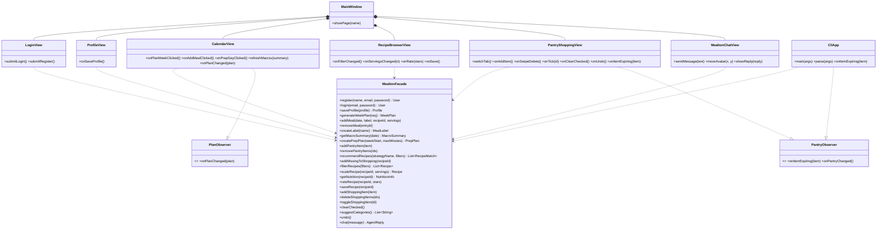

### Diagram B — Domain Model, Composite, State, Persistence

```mermaid
classDiagram
direction TB
class User { -id -name -email -passwordHash }
class Profile { -dob -weightKg -heightCm -sex -goal -allergies -restrictions -calorieTarget }
class MealLabel { -name -isCustom }
class Recipe { -id -title -steps -baseServings -tags -rating -isUserCreated -isSaved -imageUrl +scaledTo(n) Recipe }
class RecipeIngredient { -name -quantity -unit }
class NutritionInfo { -kcal -protein -carbs -fat +plus(other) NutritionInfo }
class MacroSummary { -date -total -target }
class RecipeMatch { -recipe -score -missingIngredients -reason }
class PrepPlan { -date -totalMinutes -steps +validate(maxMinutes) bool }
class PrepStep { -order -description -durationMin -recipes }
class PlanComponent { <<interface>> +getMacros() NutritionInfo +getName() String }
class WeekPlan { -weekStart +add(day) +attach(obs) +detach(obs) +notifyObservers() +getMacros() NutritionInfo }
class DayPlan { -date +add(entry) +remove(entryId) +getMacros() NutritionInfo }
class MealEntry { -id -servings +getMacros() NutritionInfo }
class PantryItem { -id -name -quantity -unit -category -expiryDate +daysLeft() int }
class ShoppingList { -items +add(item) +remove(ids) +checkedItems() List~ShoppingItem~ }
class ShoppingItem { -id -name -quantity -unit -category +toggle() +setState(s) +getStyle() String }
class ItemState { <<interface>> +toggle(item) +getStyle() String }
class PendingState { +toggle(item) +getStyle() String }
class CheckedState { +toggle(item) +getStyle() String }
class Repository~T~ { <<interface>> +save(t) +findById(id) T +findAll() List~T~ +delete(id) }
class UserRepository { +findByEmail(email) User }
class RecipeRepository { +search(filters) List~Recipe~ +update(recipe) }
class PantryRepository
class PlanRepository { +findWeek(weekStart) WeekPlan }
class ShoppingRepository
class SqliteRepositories { <<implementation>> }

User "1" *-- "1" Profile
User "1" o-- "0..*" Recipe : owns
Recipe "1" *-- "1..*" RecipeIngredient
Recipe "1" *-- "0..1" NutritionInfo
WeekPlan ..|> PlanComponent
DayPlan ..|> PlanComponent
MealEntry ..|> PlanComponent
WeekPlan "1" *-- "7" DayPlan
DayPlan "1" *-- "0..*" MealEntry
MealEntry "*" --> "1" Recipe
MealEntry "*" --> "1" MealLabel
PrepPlan "1" *-- "1..*" PrepStep
RecipeMatch "*" --> "1" Recipe
ShoppingList "1" *-- "0..*" ShoppingItem
ShoppingItem "1" --> "1" ItemState
PendingState ..|> ItemState
CheckedState ..|> ItemState
UserRepository --|> Repository
RecipeRepository --|> Repository
PantryRepository --|> Repository
PlanRepository --|> Repository
ShoppingRepository --|> Repository
SqliteRepositories ..|> UserRepository
SqliteRepositories ..|> RecipeRepository
SqliteRepositories ..|> PantryRepository
SqliteRepositories ..|> PlanRepository
SqliteRepositories ..|> ShoppingRepository
```

### Diagram C — Services and AI/Agent Components

```mermaid
classDiagram
direction TB
class MealtonFacade
class AuthService { +register(name, email, pw) User +login(email, pw) User }
class ProfileService { +saveProfile(userId, profile) Profile +calculateCalorieTarget(profile) int }
class PlanService { +generateWeekPlan(req) WeekPlan +addMeal(date, label, recipeId, servings) +removeMeal(entryId) +createLabel(name) MealLabel +getPlan(weekStart) WeekPlan +schedulePrepDay(prep, date) }
class PlanValidator { +validate(plan, profile) ValidationResult }
class MacroTracker { +onPlanChanged(plan) +getDailySummary(date) MacroSummary }
class PantryInventory { -items -observers +addItem(item) +updateItem(item) +removeItems(ids) +getItems() List~PantryItem~ +checkFreshness() +attach(obs) +detach(obs) +notifyExpiring(item) }
class FreshnessScheduler { +start() +tick() }
class RecipeRecommender { -strategy +selectStrategy(name) +recommend(filters) List~RecipeMatch~ +recommendWithMissing(filters) List~RecipeMatch~ +explain(match) String +onPantryChanged() +onItemExpiring(item) }
class RankingStrategy { <<interface>> +rank(recipes, ctx) List~RecipeMatch~ }
class PantryMatchStrategy
class SpoilageUrgencyStrategy
class MacroFitStrategy
class RecipeService { +filter(filters) List~Recipe~ +scale(recipe, n) Recipe +rate(id, stars) +save(id) +createUserRecipe(r) Recipe +autoTag(recipe) List~String~ }
class UnitConverter { +convert(qty, from, to) double }
class NutritionService { +getNutrition(recipe) NutritionInfo }
class NutritionProvider { <<interface>> +lookup(ingredient) NutritionInfo }
class UsdaNutritionAdapter { -apiClient +lookup(ingredient) NutritionInfo }
class ShoppingService { +addItem(item) +addMissing(recipe, pantry) +deleteItems(ids) +toggle(id) +clearChecked() +suggestCategories() List~String~ +undo() }
class Command { <<interface>> +execute() +undo() }
class CommandHistory { -undoStack -redoStack +execute(cmd) +undo() +redo() }
class AddShoppingItemCommand
class DeleteItemsCommand
class ToggleItemCommand
class AddMealCommand
class RemoveMealCommand
class PrepPlanner { +createPrepPlan(plan, maxMinutes) PrepPlan }
class MealtonAgent { -maxSteps +run(message) AgentReply +generatePlan(req) WeekPlan }
class AgentMemory { +addTurn(role, text) +getRecentContext(n) List~Message~ +setPreference(k, v) +getPreferences() Map }
class LLMClient { <<interface>> +chat(messages, toolSpecs) LLMResponse +generate(prompt) String }
class ClaudeAdapter { -sdk }
class OpenAIAdapter { -sdk }
class MockLLMClient
class Tool { <<interface>> +name() String +schema() ToolSpec +execute(args) ToolResult }
class PantryTool
class RecipeSearchTool
class NutritionTool
class ShoppingListTool
class CalendarTool
class ToolRegistry { +register(tool) +get(name) Tool +specs() List~ToolSpec~ }
class ToolFactory { <<abstract>> +createTool() Tool +registerWith(registry) }
class PantryToolFactory
class RecipeSearchToolFactory
class NutritionToolFactory
class ShoppingListToolFactory
class CalendarToolFactory

MealtonFacade ..> AuthService
MealtonFacade ..> ProfileService
MealtonFacade ..> PlanService
MealtonFacade ..> PantryInventory
MealtonFacade ..> RecipeRecommender
MealtonFacade ..> RecipeService
MealtonFacade ..> NutritionService
MealtonFacade ..> ShoppingService
MealtonFacade ..> PrepPlanner
MealtonFacade ..> MacroTracker
MealtonFacade ..> MealtonAgent
PlanService ..> PlanValidator
PlanService ..> MealtonAgent
PlanService o-- CommandHistory
PlanService ..> AddMealCommand
PlanService ..> RemoveMealCommand
ShoppingService o-- CommandHistory
ShoppingService ..> AddShoppingItemCommand
ShoppingService ..> DeleteItemsCommand
ShoppingService ..> ToggleItemCommand
CommandHistory "1" o-- "*" Command
AddShoppingItemCommand ..|> Command
DeleteItemsCommand ..|> Command
ToggleItemCommand ..|> Command
AddMealCommand ..|> Command
RemoveMealCommand ..|> Command
MacroTracker ..|> PlanObserver
RecipeRecommender ..|> PantryObserver
PantryInventory "1" o-- "*" PantryObserver : notifies
FreshnessScheduler --> PantryInventory
RecipeRecommender o-- RankingStrategy
PantryMatchStrategy ..|> RankingStrategy
SpoilageUrgencyStrategy ..|> RankingStrategy
MacroFitStrategy ..|> RankingStrategy
RecipeRecommender ..> PantryInventory
RecipeService ..> UnitConverter
RecipeService ..> LLMClient
NutritionService --> NutritionProvider
NutritionService ..> LLMClient
UsdaNutritionAdapter ..|> NutritionProvider
PrepPlanner ..> LLMClient
ShoppingService ..> LLMClient
MealtonAgent --> LLMClient
MealtonAgent --> ToolRegistry
MealtonAgent --> AgentMemory
ClaudeAdapter ..|> LLMClient
OpenAIAdapter ..|> LLMClient
MockLLMClient ..|> LLMClient
ToolRegistry "1" o-- "5" Tool
PantryTool ..|> Tool
RecipeSearchTool ..|> Tool
NutritionTool ..|> Tool
ShoppingListTool ..|> Tool
CalendarTool ..|> Tool
PantryToolFactory --|> ToolFactory
RecipeSearchToolFactory --|> ToolFactory
NutritionToolFactory --|> ToolFactory
ShoppingListToolFactory --|> ToolFactory
CalendarToolFactory --|> ToolFactory
ToolFactory ..> Tool : creates
PantryTool ..> PantryInventory
RecipeSearchTool ..> RecipeService
NutritionTool ..> NutritionService
ShoppingListTool ..> ShoppingService
CalendarTool ..> PlanService
```

---

### Design Patterns

Eight patterns are used. Each solves a specific problem in Mealton; for each pattern we state the design problem, the participating classes and their roles, why the pattern is appropriate, and what would be harder without it.

#### 1. Strategy — recipe ranking
- **Design problem addressed:** The Recipe Browser must rank recipes in different ways (best pantry match, use-up-spoiling-food-first, best macro fit), and the user can switch at runtime.
- **Participating classes:** `RankingStrategy` (strategy interface), `PantryMatchStrategy`, `SpoilageUrgencyStrategy`, `MacroFitStrategy` (concrete strategies), `RecipeRecommender` (context).
- **Role of each class:** the recommender holds one strategy and delegates `rank()`; each strategy encapsulates one scoring algorithm.
- **Why this pattern is appropriate:** the algorithms are interchangeable and chosen by the user.
- **What would be more difficult without it:** `RecipeRecommender` would contain a growing `if/else` block on ranking mode, and adding a new ranking rule would mean editing and re-testing the whole class.

#### 2. Observer — pantry alerts and live macro updates
- **Design problem addressed:** Several components must react when state changes without the source knowing about them: near-spoilage items must alert the UI and the recommender; any plan change must update macros and the calendar.
- **Participating classes:** `PantryInventory` (subject) with `PantryObserver` (`PantryShoppingView`, `CliApp`, `RecipeRecommender`); `WeekPlan` (subject) with `PlanObserver` (`MacroTracker`, `CalendarView`).
- **Role of each class:** subjects keep observer lists and call `notifyExpiring()` / `notifyObservers()`; observers update themselves.
- **Why this pattern is appropriate:** one-to-many, event-driven updates; the GUI and CLI both listen to the same events.
- **What would be more difficult without it:** the pantry and plan classes would need direct references to every view and service (tight coupling), and polling code would be needed for freshness alerts.

#### 3. Command — undoable edits
- **Design problem addressed:** Shopping-list edits (add, multiselect delete, tick, clear checked) and calendar edits must be undoable, and one user action (e.g. "add all missing ingredients") must be undone as a single unit.
- **Participating classes:** `Command`, `AddShoppingItemCommand`, `DeleteItemsCommand`, `ToggleItemCommand`, `AddMealCommand`, `RemoveMealCommand` (concrete commands), `CommandHistory` (invoker), `ShoppingList` / `WeekPlan` (receivers), `ShoppingService` / `PlanService` (clients).
- **Role of each class:** each command knows how to `execute()` and `undo()`; the history keeps undo/redo stacks.
- **Why this pattern is appropriate:** swipe-delete and bulk actions are easy to do by accident, so undo is a core usability need.
- **What would be more difficult without it:** each operation would need ad-hoc "previous state" bookkeeping scattered across services, and undo of compound actions would be error-prone.

#### 4. Factory Method — creating agent tools
- **Design problem addressed:** The agent's tools need different dependencies (pantry, recipes, nutrition, list, calendar), and new tools should be addable without changing the agent.
- **Participating classes:** `ToolFactory` (creator with `createTool()` and `registerWith()`), `PantryToolFactory`, `RecipeSearchToolFactory`, `NutritionToolFactory`, `ShoppingListToolFactory`, `CalendarToolFactory` (concrete creators), `Tool` (product), concrete tools, `ToolRegistry`.
- **Role of each class:** each concrete factory builds its tool with the right services injected; the registry only sees `Tool`.
- **Why this pattern is appropriate:** `MealtonAgent` depends only on the `Tool` abstraction.
- **What would be more difficult without it:** the agent or registry would use `new` on every concrete tool and know all their dependencies, so every new tool would modify core agent code.

#### 5. Adapter — LLM and nutrition API
- **Design problem addressed:** Vendor SDKs (Anthropic, OpenAI, USDA API) have incompatible interfaces, and we want to swap providers and test without network calls.
- **Participating classes:** `LLMClient` (target), `ClaudeAdapter`, `OpenAIAdapter`, `MockLLMClient` (adapters/test double), `NutritionProvider` (target), `UsdaNutritionAdapter` (adapter); clients are `MealtonAgent`, `PrepPlanner`, `RecipeService`, `NutritionService`, `ShoppingService`.
- **Role of each class:** adapters translate our `chat()` / `generate()` / `lookup()` calls to the vendor API and map responses back to our types.
- **Why this pattern is appropriate:** isolates third-party APIs at one boundary.
- **What would be more difficult without it:** vendor-specific code would be spread through all services; changing models or APIs, or writing offline tests, would be painful.

#### 6. Facade — one entry point for GUI and CLI
- **Design problem addressed:** The GUI views and the CLI need the same functionality, which involves ~10 services. We do not want UI code to know about services, agents and repositories.
- **Participating classes:** `MealtonFacade` (facade); `AuthService`, `ProfileService`, `PlanService`, `PantryInventory`, `RecipeRecommender`, `RecipeService`, `NutritionService`, `ShoppingService`, `PrepPlanner`, `MealtonAgent` (subsystem); `CliApp` and the views (clients).
- **Role of each class:** the facade offers simple use-case-level methods and coordinates subsystem calls. It also acts as the MVC controller.
- **Why this pattern is appropriate:** the CLI/GUI parity requirement is satisfied by construction, and subsystems can change without touching the UI.
- **What would be more difficult without it:** GUI and CLI would duplicate orchestration logic and become tightly coupled to every service.

#### 7. Composite — week/day/meal hierarchy
- **Design problem addressed:** Macros and names must be computed uniformly for one meal, one day and the whole week.
- **Participating classes:** `PlanComponent` (component), `MealEntry` (leaf), `DayPlan` and `WeekPlan` (composites).
- **Role of each class:** `getMacros()` on a composite sums its children; a leaf returns its recipe's scaled nutrition.
- **Why this pattern is appropriate:** the plan is naturally a tree and the macro tracker treats every level the same way.
- **What would be more difficult without it:** `MacroTracker` would contain nested loops with special cases for each level, and adding another level (e.g. "month") would require rewrites.

#### 8. State — shopping-item behaviour
- **Design problem addressed:** A shopping item behaves differently when ticked (strike-through, dulled colour, eligible for "clear checked") than when pending.
- **Participating classes:** `ShoppingItem` (context), `ItemState` (state interface), `PendingState`, `CheckedState` (concrete states).
- **Role of each class:** the item delegates `toggle()` and `getStyle()` to its current state; the state switches the item to the other state.
- **Why this pattern is appropriate:** the item's appearance and available actions depend on its state, and toggling must be reversible (works with Command undo).
- **What would be more difficult without it:** `ShoppingItem` would be full of `if (checked)` checks in the UI, list and clear logic, and adding a state (e.g. "out of stock") would touch many places.

**Also used (not counted):** *MVC* (views = View, `MealtonFacade` = Controller, domain classes = Model) and *Repository* (persistence behind interfaces so storage can be changed or mocked).

---

## 2.2 Use-Case Diagram and Use-Case Descriptions

### Actors
- **User** (primary actor; uses GUI or CLI)
- **LLM Service** (external AI service, secondary actor)
- **Nutrition API** (external service, secondary actor)
- **Scheduler / System Clock** (triggers daily freshness checks)

There is no administrator role: all users manage only their own data.

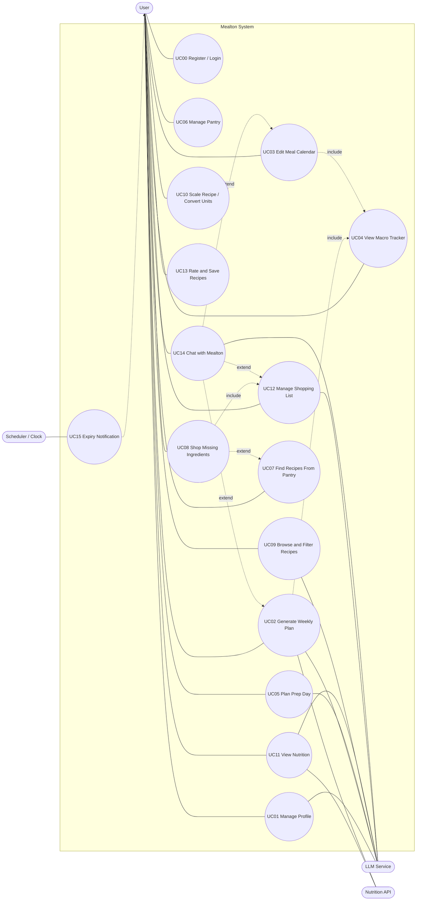

UC15 is the system-triggered side of Feature F06 (freshness notification). UC00 is supporting (not counted as a feature). `include` = always uses the other use case; `extend` = optional extra.

### Use-Case Descriptions

#### UC00 — Register / Login

- **Use Case ID:** UC00
- **Use Case Name:** Register / Login
- **Actor(s):** User
- **Goal:** access a personal account
- **Preconditions:** app open
- **Trigger:** user clicks Login/Register (or `mealton login`)
- **Main Success Scenario:**
  1. user enters email and password
  2. system looks up user
  3. password hash is verified
  4. session starts
  5. main window shown
- **Alternative/Exception Flows:**
  - wrong credentials → error, retry
  - unknown email on Register → account created
  - duplicate email → error
- **Postconditions:** user authenticated
- **Related Feature(s):** All features (supporting use case)

#### UC01 — Manage Profile

- **Use Case ID:** UC01
- **Use Case Name:** Manage Profile
- **Actor(s):** User; LLM Service (optional explanation)
- **Goal:** keep health data and restrictions up to date
- **Preconditions:** logged in
- **Trigger:** user opens Profile page and saves
- **Main Success Scenario:**
  1. user enters details
  2. system validates
  3. calorie target calculated
  4. profile saved
  5. confirmation and target shown
- **Alternative/Exception Flows:**
  - invalid values → error
  - LLM down → target without explanation
  - unsafe target → capped with warning
- **Postconditions:** profile persisted
- **Related Feature(s):** F01

#### UC02 — Generate Weekly Plan

- **Use Case ID:** UC02
- **Use Case Name:** Generate Weekly Plan
- **Actor(s):** User; LLM Service; Nutrition API
- **Goal:** get a weekly plan fitting goals/allergies/pantry
- **Preconditions:** logged in, profile exists
- **Trigger:** click "Plan for the week"
- **Main Success Scenario:**
  1. user sets optional preferences
  2. agent reads profile and pantry
  3. agent searches recipes with tools
  4. agent drafts plan
  5. validator checks allergens and calories
  6. plan saved and shown
  7. macros update
- **Alternative/Exception Flows:**
  - validation fails → one re-plan with feedback
  - still fails → error and manual option
  - LLM/API error → retry message
- **Postconditions:** `WeekPlan` saved
- **Related Feature(s):** F02, F04

#### UC03 — Edit Meal Calendar

- **Use Case ID:** UC03
- **Use Case Name:** Edit Meal Calendar
- **Actor(s):** User
- **Goal:** manually add/remove meals and manage labels
- **Preconditions:** logged in
- **Trigger:** click "+ Add meal"
- **Main Success Scenario:**
  1. user picks day, label (or creates custom), recipe, servings
  2. system checks allergens
  3. meal added
  4. macros refresh
- **Alternative/Exception Flows:**
  - allergen warning → confirm or cancel
  - duplicate label → rejected
  - undo is available
- **Postconditions:** plan updated
- **Related Feature(s):** F03, F04

#### UC04 — View Macro Tracker

- **Use Case ID:** UC04
- **Use Case Name:** View Macro Tracker
- **Actor(s):** User
- **Goal:** see calories/macros vs targets
- **Preconditions:** logged in
- **Trigger:** viewing the calendar or any plan change
- **Main Success Scenario:**
  1. plan changes
  2. tracker recomputes totals
  3. progress bars updated
- **Alternative/Exception Flows:**
  - recipe lacks nutrition → flagged as incomplete
- **Postconditions:** summary displayed
- **Related Feature(s):** F04

#### UC05 — Plan Prep Day

- **Use Case ID:** UC05
- **Use Case Name:** Plan Prep Day
- **Actor(s):** User; LLM Service
- **Goal:** batch-cook the week's meals in limited time
- **Preconditions:** a week plan exists
- **Trigger:** click "Schedule prep day"
- **Main Success Scenario:**
  1. user picks date and time limit
  2. planner builds task list from the plan
  3. LLM orders and parallelises tasks
  4. total time validated
  5. prep day added to the calendar
- **Alternative/Exception Flows:**
  - over time limit → retry with reduced scope and notify
  - no plan → ask to create one
- **Postconditions:** `PrepPlan` saved
- **Related Feature(s):** F05

#### UC06 — Manage Pantry

- **Use Case ID:** UC06
- **Use Case Name:** Manage Pantry
- **Actor(s):** User
- **Goal:** keep an accurate inventory
- **Preconditions:** logged in
- **Trigger:** open Pantry tab
- **Main Success Scenario:**
  1. user adds/edits item with quantity and expiry
  2. inventory saved
  3. observers notified
  4. list refreshed. Swipe/multiselect removes items
- **Alternative/Exception Flows:**
  - invalid input → rejected
  - duplicate item → merge offered
- **Postconditions:** inventory updated
- **Related Feature(s):** F06

#### UC07 — Find Recipes From Pantry

- **Use Case ID:** UC07
- **Use Case Name:** Find Recipes From Pantry
- **Actor(s):** User
- **Goal:** know what can be cooked now
- **Preconditions:** logged in
- **Trigger:** open "Can make now" tab
- **Main Success Scenario:**
  1. user chooses ranking
  2. system loads pantry and recipes
  3. strategy ranks
  4. results shown as thumbnails with reason
- **Alternative/Exception Flows:**
  - empty pantry → prompt to add items
  - no matches → suggest UC08
- **Postconditions:** none
- **Related Feature(s):** F07

#### UC08 — Shop Missing Ingredients

- **Use Case ID:** UC08
- **Use Case Name:** Shop Missing Ingredients
- **Actor(s):** User
- **Goal:** buy what is missing for a nearly-possible recipe
- **Preconditions:** logged in
- **Trigger:** "Add missing to list" on a recipe
- **Main Success Scenario:**
  1. system computes missing ingredients
  2. adds each to the shopping list as one undoable batch
  3. confirmation shown
- **Alternative/Exception Flows:**
  - item already on list → quantity merged
  - undo removes batch
- **Postconditions:** list updated
- **Related Feature(s):** F08

#### UC09 — Browse and Filter Recipes

- **Use Case ID:** UC09
- **Use Case Name:** Browse and Filter Recipes
- **Actor(s):** User; LLM Service (tagging)
- **Goal:** find recipes by type
- **Preconditions:** logged in
- **Trigger:** select filter chips
- **Main Success Scenario:**
  1. user selects filters
  2. system filters recipes
  3. thumbnails updated
- **Alternative/Exception Flows:**
  - no results → suggest clearing filters
  - LLM tagging unavailable → recipe untagged for now
- **Postconditions:** none
- **Related Feature(s):** F09

#### UC10 — Scale Recipe / Convert Units

- **Use Case ID:** UC10
- **Use Case Name:** Scale Recipe / Convert Units
- **Actor(s):** User
- **Goal:** adjust servings and measurement units
- **Preconditions:** a recipe is open
- **Trigger:** change servings or unit
- **Main Success Scenario:**
  1. user enters servings
  2. system scales quantities
  3. converts units
  4. updated recipe shown
- **Alternative/Exception Flows:**
  - servings ≤ 0 → rejected
  - no density data → original unit with note
- **Postconditions:** none
- **Related Feature(s):** F10

#### UC11 — View Nutrition

- **Use Case ID:** UC11
- **Use Case Name:** View Nutrition
- **Actor(s):** User; Nutrition API; LLM Service
- **Goal:** see nutrition for a recipe
- **Preconditions:** recipe open
- **Trigger:** open Nutrition panel
- **Main Success Scenario:**
  1. system looks up each ingredient
  2. sums values per serving
  3. panel shows totals
- **Alternative/Exception Flows:**
  - API fails → LLM estimate flagged
  - both fail → partial totals
- **Postconditions:** nutrition cached on recipe
- **Related Feature(s):** F11

#### UC12 — Manage Shopping List

- **Use Case ID:** UC12
- **Use Case Name:** Manage Shopping List
- **Actor(s):** User; LLM Service (categories)
- **Goal:** maintain a grocery list
- **Preconditions:** logged in
- **Trigger:** open List tab
- **Main Success Scenario:**
  1. user adds items
  2. assigns/accepts suggested categories
  3. ticks items (strike-through, dulled)
  4. clears ticked or deletes by swipe/multiselect
  5. may undo
- **Alternative/Exception Flows:**
  - nothing selected → ignored
  - empty undo stack → disabled
  - LLM down → default categories
- **Postconditions:** list persisted
- **Related Feature(s):** F12

#### UC13 — Rate and Save Recipes

- **Use Case ID:** UC13
- **Use Case Name:** Rate and Save Recipes
- **Actor(s):** User
- **Goal:** organise favourites and own recipes
- **Preconditions:** recipe visible
- **Trigger:** click stars/heart or "New recipe"
- **Main Success Scenario:**
  1. user rates or saves
  2. system updates the recipe
  3. shown in My/Saved tabs
- **Alternative/Exception Flows:**
  - invalid rating rejected
  - duplicate save ignored
- **Postconditions:** recipe updated
- **Related Feature(s):** F13

#### UC14 — Chat with Mealton

- **Use Case ID:** UC14
- **Use Case Name:** Chat with Mealton
- **Actor(s):** User; LLM Service
- **Goal:** accomplish tasks via natural language
- **Preconditions:** logged in
- **Trigger:** user sends a message (avatar chat or `mealton chat`)
- **Main Success Scenario:**
  1. message sent to agent
  2. agent loads memory
  3. LLM decides tool calls
  4. tools run and results are returned
  5. steps repeat until done
  6. reply shown
  7. changes appear in calendar/pantry/list
- **Alternative/Exception Flows:**
  - tool error → agent retries or explains
  - step limit → partial result and question
  - destructive action → confirmation first
- **Postconditions:** memory updated; possible data changes
- **Related Feature(s):** F14

#### UC15 — Expiry Notification

- **Use Case ID:** UC15
- **Use Case Name:** Expiry Notification
- **Actor(s):** Scheduler/Clock; User
- **Goal:** avoid food waste
- **Preconditions:** pantry has items with expiry dates
- **Trigger:** daily timer
- **Main Success Scenario:**
  1. scheduler ticks
  2. system finds items expiring within 3 days
  3. observers notified
  4. UI/CLI shows alert
  5. recommender prioritises matching recipes
- **Alternative/Exception Flows:**
  - no expiring items → nothing shown
- **Postconditions:** user informed
- **Related Feature(s):** F06, F07

---

## 2.3 Sequence Diagrams

All participants and method names come from the class diagrams above.

### SD01 — Login and Save Profile (UC00, UC01 · F01)
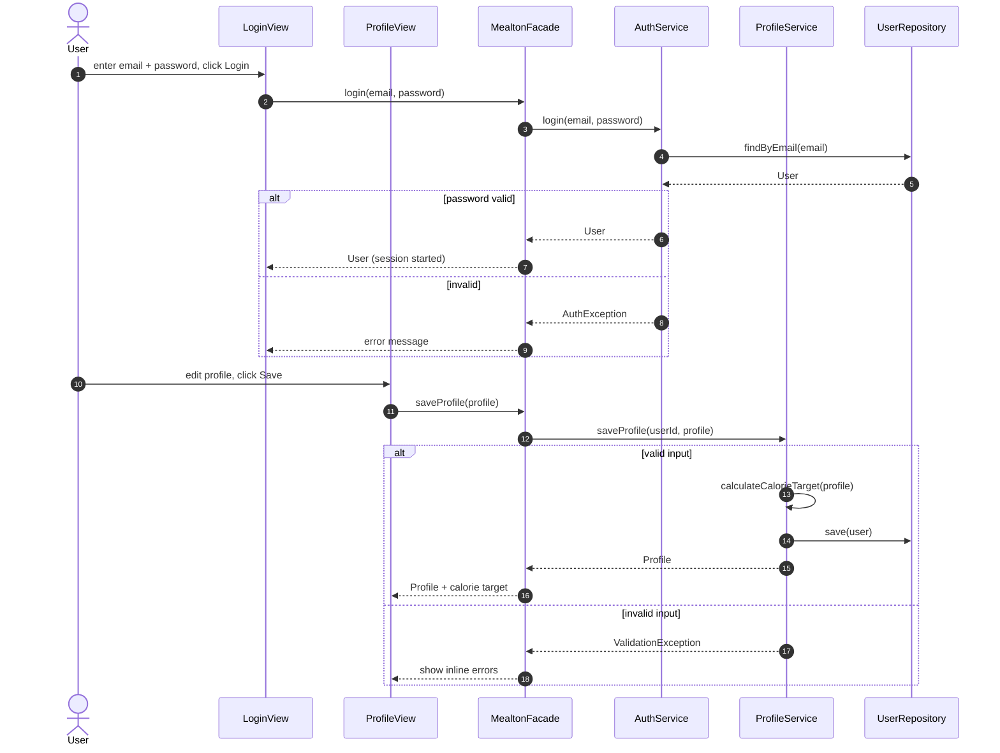

### SD02 — Generate Weekly Plan (UC02 · F02)
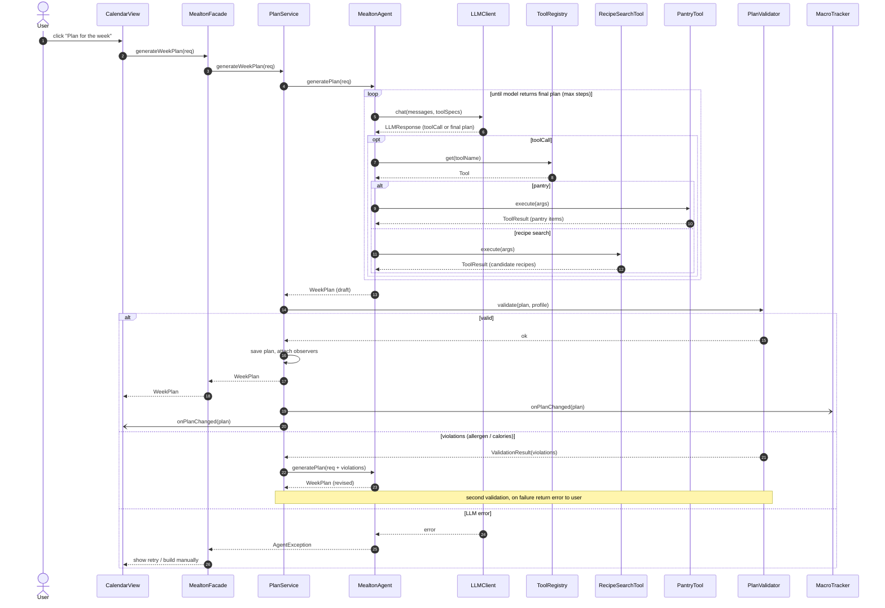

### SD03 — Edit Calendar and Update Macros (UC03, UC04 · F03, F04)
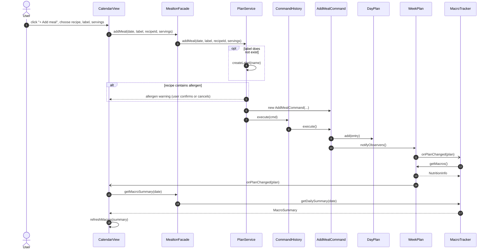

### SD04 — Plan Prep Day (UC05 · F05)
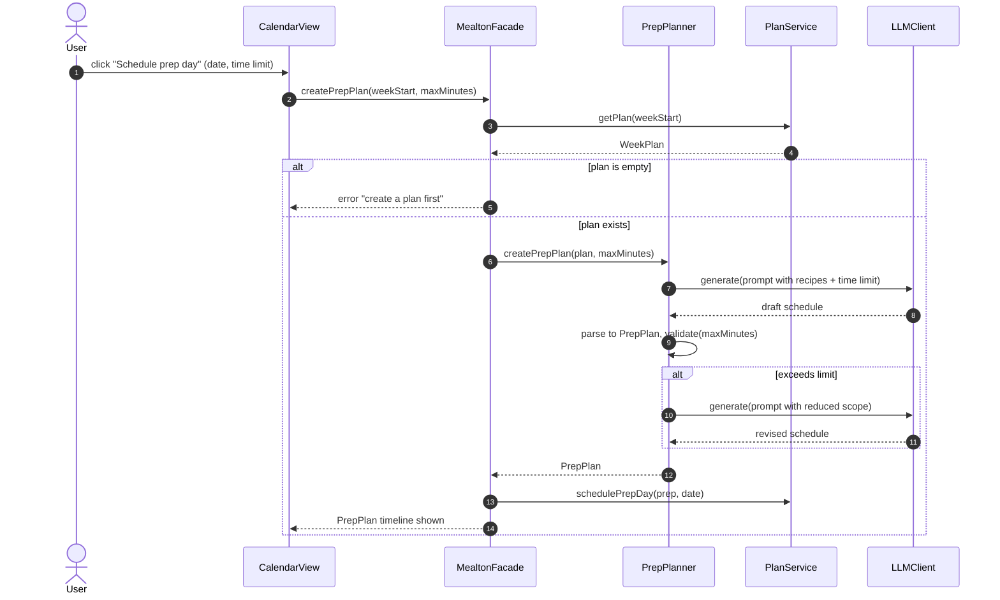

### SD05 — Pantry Update and Expiry Notification (UC06, UC15 · F06)
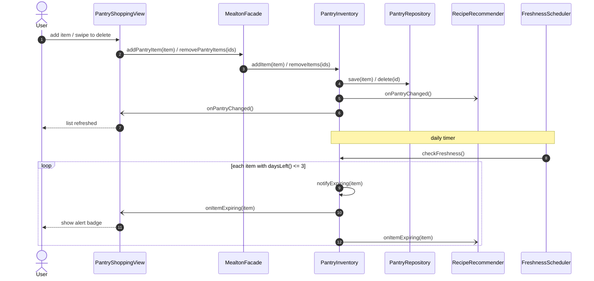

### SD06 — Recipes From Pantry and Missing Ingredients (UC07, UC08, UC09 · F07, F08, F09)
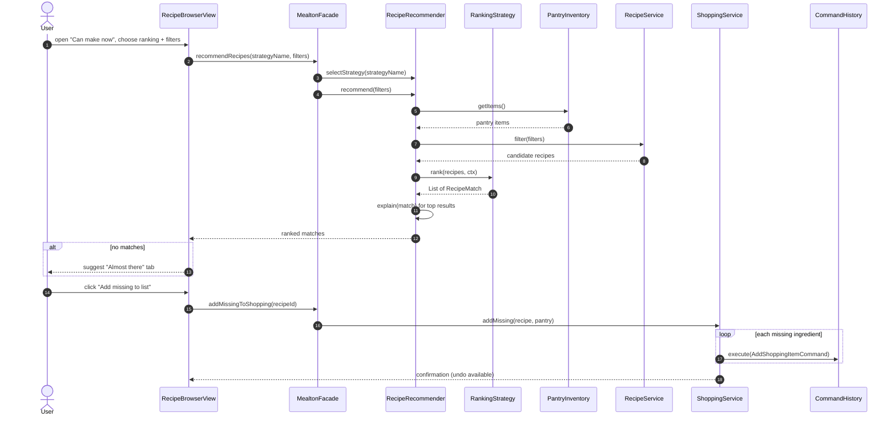

### SD07 — Scale Recipe, Nutrition, Rate and Save (UC10, UC11, UC13 · F10, F11, F13)
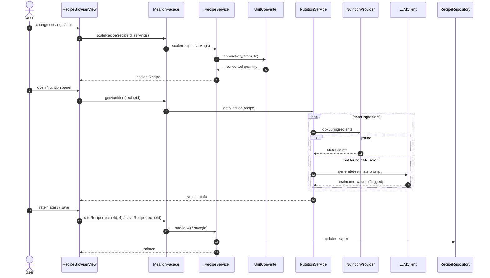

### SD08 — Shopping List: Add, Tick, Delete, Clear, Undo (UC12 · F12)
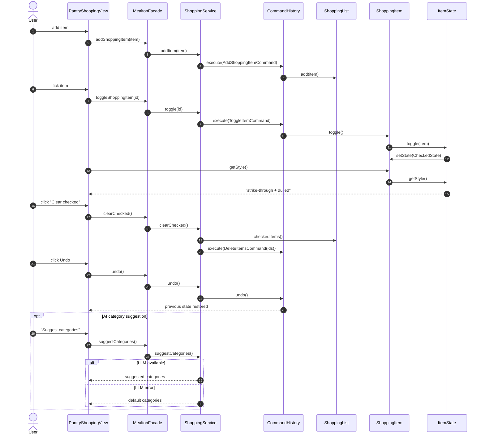

### SD09 — Chat with Mealton (UC14 · F14)
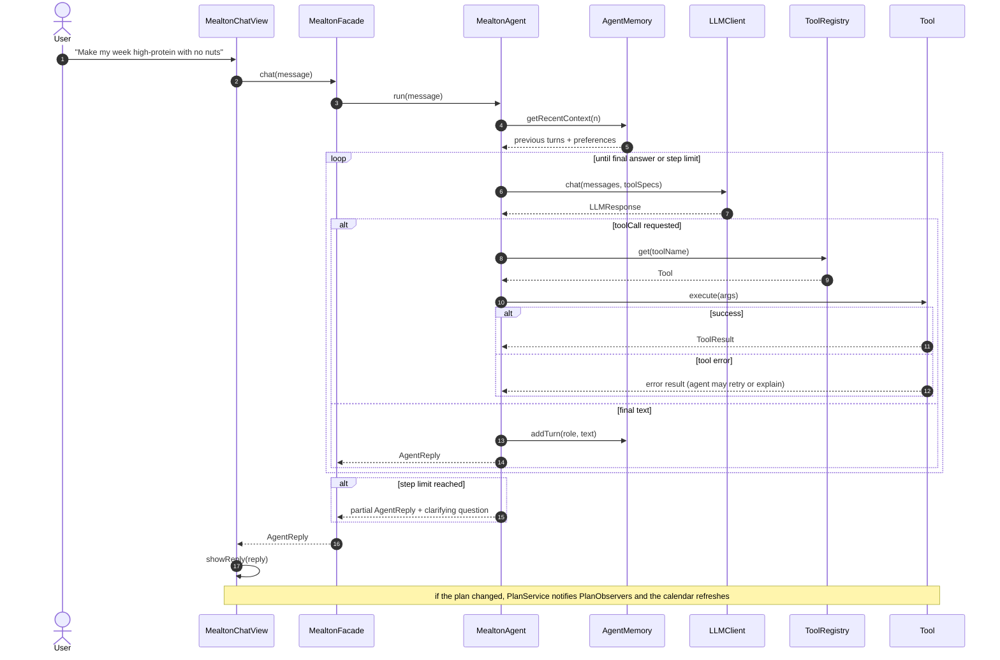

---

# Task 3: Feature-to-Design Traceability

Every feature is traceable to the classes and methods that implement it, the use case that describes the interaction, the sequence diagram that shows the runtime behaviour, and the design pattern(s) involved.

| Feature | Description | Type | Related Use Case | Classes | Key Methods | Sequence Diagram | Design Pattern(s) |
|---|---|---|---|---|---|---|---|
| F01 | Profile and dietary constraints | Hybrid | UC01 Manage Profile | ProfileView, MealtonFacade, ProfileService, UserRepository, Profile | saveProfile(), calculateCalorieTarget() | SD01 Login and Save Profile | Facade, MVC, Repository |
| F02 | AI weekly plan generation | AI | UC02 Generate Weekly Plan | CalendarView, MealtonFacade, PlanService, MealtonAgent, LLMClient, ToolRegistry, RecipeSearchTool, PantryTool, PlanValidator, WeekPlan | generateWeekPlan(), generatePlan(), chat(), execute(), validate() | SD02 Generate Weekly Plan | Facade, Adapter, Factory Method, Composite, Observer |
| F03 | Meal calendar editing and custom labels | Deterministic | UC03 Edit Meal Calendar | CalendarView, MealtonFacade, PlanService, CommandHistory, AddMealCommand, DayPlan, MealLabel | addMeal(), createLabel(), execute(), undo() | SD03 Edit Calendar and Update Macros | Command, Composite, Observer |
| F04 | Macro tracker | Deterministic | UC04 View Macro Tracker | MacroTracker, WeekPlan, DayPlan, MealEntry, CalendarView | onPlanChanged(), getDailySummary(), getMacros() | SD03 Edit Calendar and Update Macros | Observer, Composite |
| F05 | Prep-day planner | AI | UC05 Plan Prep Day | CalendarView, MealtonFacade, PrepPlanner, PlanService, LLMClient, PrepPlan | createPrepPlan(), generate(), validate(), schedulePrepDay() | SD04 Plan Prep Day | Facade, Adapter |
| F06 | Pantry inventory and freshness tracking | Deterministic | UC06 Manage Pantry, UC15 Expiry Notification | PantryShoppingView, MealtonFacade, PantryInventory, PantryRepository, FreshnessScheduler, PantryItem | addItem(), removeItems(), checkFreshness(), notifyExpiring() | SD05 Pantry Update and Expiry Notification | Observer, Repository |
| F07 | Recipes from current pantry | Hybrid | UC07 Find Recipes From Pantry | RecipeBrowserView, MealtonFacade, RecipeRecommender, RankingStrategy (3 concrete), PantryInventory | selectStrategy(), recommend(), rank(), explain() | SD06 Recipes From Pantry and Missing Ingredients | Strategy, Observer, Facade |
| F08 | Missing-ingredient suggestions to shopping list | Hybrid | UC08 Shop Missing Ingredients | RecipeRecommender, ShoppingService, CommandHistory, AddShoppingItemCommand | recommendWithMissing(), addMissing(), execute() | SD06 Recipes From Pantry and Missing Ingredients | Strategy, Command |
| F09 | Recipe filters and AI tagging | Hybrid | UC09 Browse and Filter Recipes | RecipeBrowserView, RecipeService, LLMClient, RecipeRepository | filter(), autoTag(), generate() | SD06 Recipes From Pantry and Missing Ingredients | Adapter, Facade |
| F10 | Serving scaling and unit conversion | Deterministic | UC10 Scale Recipe / Convert Units | RecipeBrowserView, RecipeService, UnitConverter, Recipe | scaleRecipe(), scale(), convert() | SD07 Scale Recipe, Nutrition, Rate and Save | Facade |
| F11 | Nutrition breakdown | Hybrid | UC11 View Nutrition | NutritionService, NutritionProvider, UsdaNutritionAdapter, LLMClient, NutritionInfo | getNutrition(), lookup(), generate() | SD07 Scale Recipe, Nutrition, Rate and Save | Adapter |
| F12 | Shopping list, categories, check-off, clear, undo | Hybrid | UC12 Manage Shopping List | PantryShoppingView, ShoppingService, CommandHistory, Add/Delete/ToggleItemCommand, ShoppingList, ShoppingItem, ItemState, PendingState, CheckedState | addItem(), toggle(), clearChecked(), deleteItems(), undo(), suggestCategories(), getStyle() | SD08 Shopping List: Add, Tick, Delete, Clear, Undo | Command, State |
| F13 | Rate recipes, My/Saved recipes | Deterministic | UC13 Rate and Save Recipes | RecipeBrowserView, RecipeService, RecipeRepository, Recipe | rateRecipe(), saveRecipe(), createUserRecipe(), update() | SD07 Scale Recipe, Nutrition, Rate and Save | Repository, Facade |
| F14 | Mealton chat agent | AI | UC14 Chat with Mealton | MealtonChatView, MealtonFacade, MealtonAgent, AgentMemory, LLMClient, ToolRegistry, ToolFactory + 5 concrete tools | chat(), run(), getRecentContext(), addTurn(), execute() | SD09 Chat with Mealton | Factory Method, Adapter, Facade |

**Pattern coverage:** Strategy (F07, F08) · Observer (F02, F03, F04, F06, F07) · Command (F03, F08, F12) · Factory Method (F02, F14) · Adapter (F02, F05, F09, F11, F14) · Facade (all) · Composite (F02, F03, F04) · State (F12).

---

# Task 4: Explain How Each Feature Is Realized

### F01 — Profile and Dietary Constraints
**Related Use Case:** UC01 — Manage Profile
**Related Sequence Diagram:** SD01 — Login and Save Profile

**Classes involved:**
- `ProfileView` — collects personal details, allergies and restrictions from the user.
- `MealtonFacade` — single entry point; forwards the request to the right service.
- `ProfileService` — validates the input and computes the calorie target.
- `UserRepository` — persists the user and profile.
- `Profile` — holds the data; its allergies are later used by `PlanValidator`.

**Important methods:**
- `ProfileView.onSaveProfile()`
- `MealtonFacade.saveProfile()`
- `ProfileService.saveProfile()`
- `ProfileService.calculateCalorieTarget()`
- `UserRepository.save()`

**Execution:**
When the user presses Save, `onSaveProfile()` sends the form to `MealtonFacade.saveProfile()`, which calls `ProfileService`. The service validates the ranges, computes the target with the Mifflin–St Jeor formula (adjusted for the goal and floored at a safe minimum), and stores the `Profile` through `UserRepository`. The calorie target is returned and shown in the GUI.

### F02 — AI Weekly Meal Plan Generation
**Related Use Case:** UC02 — Generate Weekly Plan
**Related Sequence Diagram:** SD02 — Generate Weekly Plan

**Classes involved:**
- `CalendarView` — "Plan for the week" button and display of the resulting plan.
- `MealtonFacade` — receives the request from the GUI or CLI.
- `PlanService` — coordinates generation, validation, saving and notification.
- `MealtonAgent` — runs the reasoning and tool loop to draft the plan.
- `LLMClient` (`ClaudeAdapter`) — communicates with the selected LLM.
- `ToolRegistry`, `RecipeSearchTool`, `PantryTool` — let the agent read the pantry and search recipes.
- `PlanValidator` — deterministic check of allergens and calorie bounds.
- `WeekPlan` / `DayPlan` / `MealEntry` — the generated plan (Composite).

**Important methods:**
- `CalendarView.onPlanWeekClicked()`
- `MealtonFacade.generateWeekPlan()`
- `PlanService.generateWeekPlan()`
- `MealtonAgent.generatePlan()`
- `LLMClient.chat()`
- `Tool.execute()`
- `PlanValidator.validate()`

**Execution:**
`MealtonFacade` passes the request to `PlanService`, which hands it to `MealtonAgent.generatePlan()`. The agent loops: it sends context and tool schemas to the LLM, runs any requested tools through `ToolRegistry` (reading the pantry, searching recipes) and returns the results to the LLM until a draft `WeekPlan` exists. `PlanService` validates the draft; on violations it asks the agent to re-plan once. A valid plan is saved, `MacroTracker` and `CalendarView` are notified, and the calendar displays the plan.

### F03 — Meal Calendar Editing and Custom Labels
**Related Use Case:** UC03 — Edit Meal Calendar
**Related Sequence Diagram:** SD03 — Edit Calendar and Update Macros

**Classes involved:**
- `CalendarView` — "+ Add meal" box and label selection.
- `MealtonFacade` — entry point.
- `PlanService` — creates the command and manages labels.
- `AddMealCommand` / `RemoveMealCommand` — encapsulate an undoable plan edit (Command).
- `CommandHistory` — executes commands and keeps the undo/redo stacks.
- `DayPlan` / `WeekPlan` — hold the meals and notify observers after a change.
- `MealLabel` — suggested or user-created label.

**Important methods:**
- `CalendarView.onAddMealClicked()`
- `MealtonFacade.addMeal()`
- `PlanService.addMeal()` / `createLabel()`
- `CommandHistory.execute()` / `undo()`
- `DayPlan.add()`

**Execution:**
`PlanService` wraps the edit in an `AddMealCommand` and runs it through `CommandHistory`, which makes it undoable. The command adds a `MealEntry` to the `DayPlan`, and the plan notifies its observers. If the label does not exist, `createLabel()` creates a `MealLabel` with `isCustom = true`. If the recipe contains one of the user's allergens, the user must confirm first.

### F04 — Macro Tracker
**Related Use Case:** UC04 — View Macro Tracker
**Related Sequence Diagram:** SD03 — Edit Calendar and Update Macros

**Classes involved:**
- `MacroTracker` — plan observer that recomputes totals and compares them with the user's targets.
- `PlanObserver` — interface implemented by the tracker and the calendar view.
- `WeekPlan` / `DayPlan` / `MealEntry` — Composite hierarchy that sums nutrition at every level.
- `CalendarView` — shows progress bars.
- `NutritionInfo`, `MacroSummary` — value objects for totals.

**Important methods:**
- `MacroTracker.onPlanChanged()`
- `PlanComponent.getMacros()`
- `MacroTracker.getDailySummary()`
- `CalendarView.refreshMacros()`

**Execution:**
After any plan change, `WeekPlan.notifyObservers()` calls `MacroTracker.onPlanChanged()`. The tracker asks the composite for totals (each level sums its children), builds a `MacroSummary` against the profile targets, and `CalendarView.refreshMacros()` redraws the bars.

### F05 — Prep-Day Planner
**Related Use Case:** UC05 — Plan Prep Day
**Related Sequence Diagram:** SD04 — Plan Prep Day

**Classes involved:**
- `CalendarView` — asks for date and time limit, shows the timeline.
- `MealtonFacade` — entry point.
- `PrepPlanner` — builds the batch-cooking schedule.
- `LLMClient` — drafts the ordered, parallelised task list.
- `PlanService` — supplies the week plan and stores the scheduled prep day.
- `PrepPlan` / `PrepStep` — result with ordered steps and durations.

**Important methods:**
- `CalendarView.onPrepDayClicked()`
- `MealtonFacade.createPrepPlan()`
- `PrepPlanner.createPrepPlan()`
- `LLMClient.generate()`
- `PrepPlan.validate()`
- `PlanService.schedulePrepDay()`

**Execution:**
The planner reads the recipes in the week plan and asks the LLM for a task schedule that fits the time limit. The response is parsed into a `PrepPlan` and `validate(maxMinutes)` checks the total duration. If it is too long, the planner retries with fewer batched recipes. The final plan is added to the calendar through `PlanService.schedulePrepDay()`.

### F06 — Pantry Inventory and Freshness Tracking
**Related Use Case:** UC06 — Manage Pantry (and UC15 — Expiry Notification)
**Related Sequence Diagram:** SD05 — Pantry Update and Expiry Notification

**Classes involved:**
- `PantryShoppingView` — pantry tab, swipe/multiselect delete, expiry badge.
- `MealtonFacade` — entry point.
- `PantryInventory` — subject: stores items and notifies observers.
- `PantryRepository` — persistence.
- `FreshnessScheduler` — daily timer that triggers the freshness check.
- `PantryObserver` — implemented by the view, the CLI and `RecipeRecommender`.
- `PantryItem` — one ingredient with quantity and expiry date.

**Important methods:**
- `PantryInventory.addItem()` / `removeItems()`
- `PantryInventory.checkFreshness()`
- `PantryInventory.notifyExpiring()`
- `FreshnessScheduler.tick()`
- `PantryItem.daysLeft()`

**Execution:**
Add, edit and delete operations are saved through the repository and observers are notified. Once a day `FreshnessScheduler.tick()` calls `checkFreshness()`, which calls `notifyExpiring()` for items with 3 days or fewer left. The view shows an alert and `RecipeRecommender` boosts recipes that use those items.

### F07 — Recipes from Current Pantry
**Related Use Case:** UC07 — Find Recipes From Pantry
**Related Sequence Diagram:** SD06 — Recipes From Pantry and Missing Ingredients

**Classes involved:**
- `RecipeBrowserView` — "Can make now" tab, ranking dropdown, thumbnails.
- `MealtonFacade` — entry point.
- `RecipeRecommender` — Strategy context; filters and ranks recipes.
- `RankingStrategy` with `PantryMatchStrategy`, `SpoilageUrgencyStrategy`, `MacroFitStrategy` — interchangeable ranking algorithms.
- `PantryInventory` — source of current ingredients.
- `RecipeService` — recipe filtering; `LLMClient` — one-line reason for each match.
- `RecipeMatch` — a recipe with score, missing ingredients and reason.

**Important methods:**
- `MealtonFacade.recommendRecipes()`
- `RecipeRecommender.selectStrategy()` / `recommend()` / `explain()`
- `RankingStrategy.rank()`
- `PantryInventory.getItems()`

**Execution:**
The facade selects the ranking strategy chosen by the user and calls `recommend()`. The recommender gets the pantry, filters recipes (excluding the user's allergens), delegates scoring to the strategy, and asks the LLM for a short reason for the top results. The ranked `RecipeMatch` list is returned to the GUI.

### F08 — Missing-Ingredient Suggestions → Shopping List
**Related Use Case:** UC08 — Shop Missing Ingredients
**Related Sequence Diagram:** SD06 — Recipes From Pantry and Missing Ingredients

**Classes involved:**
- `RecipeBrowserView` — "Almost there" tab with an "Add missing to list" button.
- `RecipeRecommender` — finds recipes with few missing ingredients.
- `RecipeMatch` — carries the `missingIngredients`.
- `ShoppingService` — turns missing ingredients into list items.
- `AddShoppingItemCommand` and `CommandHistory` — make the whole batch undoable.

**Important methods:**
- `RecipeRecommender.recommendWithMissing()`
- `MealtonFacade.addMissingToShopping()`
- `ShoppingService.addMissing()`
- `CommandHistory.execute()`

**Execution:**
Missing items are computed by comparing a recipe's ingredients with the pantry. When the user clicks "Add missing to list", `ShoppingService.addMissing()` creates one `AddShoppingItemCommand` per item (merging duplicates) and runs them through `CommandHistory`, so Undo can remove them.

### F09 — Recipe Filters and AI Tagging
**Related Use Case:** UC09 — Browse and Filter Recipes
**Related Sequence Diagram:** SD06 — Recipes From Pantry and Missing Ingredients

**Classes involved:**
- `RecipeBrowserView` — filter chips and clickable thumbnails.
- `MealtonFacade` — entry point.
- `RecipeService` — applies filters and generates tags.
- `RecipeRepository` — stores and searches recipes by tag.
- `LLMClient` — produces tags for new or untagged recipes.

**Important methods:**
- `RecipeBrowserView.onFilterChanged()`
- `MealtonFacade.filterRecipes()`
- `RecipeService.filter()`
- `RecipeService.autoTag()`

**Execution:**
Selected chips become filters that `RecipeService.filter()` applies over stored tags. When a recipe is created or imported without tags, `autoTag()` asks the LLM for tags from a fixed vocabulary and saves them with the recipe. If the LLM is unavailable, the recipe is saved untagged and tagged later.

### F10 — Serving Scaling and Unit Conversion
**Related Use Case:** UC10 — Scale Recipe / Convert Units
**Related Sequence Diagram:** SD07 — Scale Recipe, Nutrition, Rate and Save

**Classes involved:**
- `RecipeBrowserView` — servings stepper and unit toggle.
- `MealtonFacade` — entry point.
- `RecipeService` — scales the recipe.
- `UnitConverter` — converts between grams, cups, ml, tbsp and tsp.
- `Recipe` / `RecipeIngredient` — the data being scaled.

**Important methods:**
- `RecipeBrowserView.onServingsChanged()`
- `MealtonFacade.scaleRecipe()`
- `RecipeService.scale()`
- `Recipe.scaledTo()`
- `UnitConverter.convert()`

**Execution:**
Each ingredient quantity is multiplied by `newServings / baseServings`, then converted to the chosen display unit using ingredient-specific density tables (for grams ⇄ cups). The scaled `Recipe` is returned; the stored recipe is not changed.

### F11 — Nutrition Breakdown
**Related Use Case:** UC11 — View Nutrition
**Related Sequence Diagram:** SD07 — Scale Recipe, Nutrition, Rate and Save

**Classes involved:**
- `RecipeBrowserView` — nutrition panel.
- `NutritionService` — sums nutrition over all ingredients.
- `NutritionProvider` / `UsdaNutritionAdapter` — look up each ingredient in the nutrition API (Adapter).
- `LLMClient` — estimates ingredients the API cannot find.
- `NutritionInfo` — calories, protein, carbs and fat.

**Important methods:**
- `MealtonFacade.getNutrition()`
- `NutritionService.getNutrition()`
- `NutritionProvider.lookup()`
- `NutritionInfo.plus()`

**Execution:**
For each ingredient, the service queries the provider, scales the result by quantity and adds it to the total. Unknown ingredients are estimated by the LLM and flagged "estimated". Totals are divided by servings and shown in the panel.

### F12 — Shopping List with Categories, Check-off and Clear
**Related Use Case:** UC12 — Manage Shopping List
**Related Sequence Diagram:** SD08 — Shopping List: Add, Tick, Delete, Clear, Undo

**Classes involved:**
- `PantryShoppingView` — Pantry ⇄ List tab switcher, tick, swipe/multiselect delete, "Clear checked", Undo.
- `ShoppingService` — turns each user action into a command; suggests categories.
- `AddShoppingItemCommand`, `DeleteItemsCommand`, `ToggleItemCommand` — undoable operations (Command).
- `CommandHistory` — invoker with undo/redo stacks.
- `ShoppingList` / `ShoppingItem` — the list and its items.
- `ItemState`, `PendingState`, `CheckedState` — state of an item (State).
- `LLMClient` — suggests category names.

**Important methods:**
- `ShoppingService.addItem()` / `toggle()` / `deleteItems()` / `clearChecked()` / `undo()`
- `ShoppingService.suggestCategories()`
- `ShoppingItem.toggle()`
- `ItemState.getStyle()`

**Execution:**
Every list change is a `Command` executed through `CommandHistory`. Ticking an item calls `ShoppingItem.toggle()`, which delegates to its current `ItemState` and swaps `PendingState` ↔ `CheckedState`. The view calls `getStyle()` to draw the strike-through and dulled text. "Clear checked" deletes all items in the checked state as one undoable command.

### F13 — Recipe Rating, My Recipes and Saved Recipes
**Related Use Case:** UC13 — Rate and Save Recipes
**Related Sequence Diagram:** SD07 — Scale Recipe, Nutrition, Rate and Save

**Classes involved:**
- `RecipeBrowserView` — star widget, save button, My Recipes / Saved tabs.
- `MealtonFacade` — entry point.
- `RecipeService` — validates and applies rating, save and creation.
- `RecipeRepository` — persistence.
- `Recipe` — has `rating`, `isSaved` and `isUserCreated`.

**Important methods:**
- `MealtonFacade.rateRecipe()` / `saveRecipe()`
- `RecipeService.rate()` / `save()` / `createUserRecipe()`
- `RecipeRepository.update()`

**Execution:**
The service checks that the rating is 1–5, updates the recipe's flags and persists it. "My Recipes" shows recipes with `isUserCreated = true`; "Saved" shows `isSaved = true`. A newly created recipe is auto-tagged (F09).

### F14 — Mealton Chat Agent
**Related Use Case:** UC14 — Chat with Mealton
**Related Sequence Diagram:** SD09 — Chat with Mealton

**Classes involved:**
- `MealtonChatView` — draggable avatar and chat panel.
- `MealtonFacade` — entry point shared by GUI and CLI.
- `MealtonAgent` — reasoning and tool loop.
- `AgentMemory` — recent turns and learned preferences.
- `LLMClient` — the model.
- `ToolRegistry` — looks up tools by name.
- `ToolFactory` and its five concrete factories — create the tools (Factory Method).
- `PantryTool`, `RecipeSearchTool`, `NutritionTool`, `ShoppingListTool`, `CalendarTool` — the agent's tools.

**Important methods:**
- `MealtonChatView.sendMessage()`
- `MealtonFacade.chat()`
- `MealtonAgent.run()`
- `AgentMemory.getRecentContext()` / `addTurn()`
- `LLMClient.chat()`
- `ToolRegistry.get()`
- `Tool.execute()`

**Execution:**
The agent loads recent turns and stored preferences, then loops: it asks the LLM what to do, executes any requested tool and feeds the result back. Each tool wraps an existing service (for example `CalendarTool` → `PlanService`), so agent actions use the same validated code as manual actions and the same observers refresh the UI. A step limit prevents endless loops, destructive actions need user confirmation, and the final `AgentReply` is shown in the chat view.

---

*End of Stage 1 report.*
